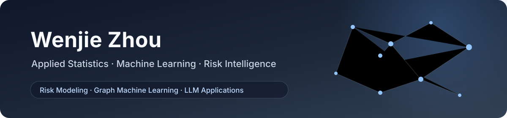

  

  <strong>M.S. Student in Applied Statistics at Shanghai University of Finance and Economics</strong> 
  上海财经大学应用统计硕士，关注风险建模、图机器学习与大模型应用

  
  
  

## About Me

- Pursuing an M.S. in Applied Statistics at Shanghai University of Finance and Economics.
- Interested in **Risk Modeling · Graph Machine Learning · LLM Applications**.
- Experienced in risk strategy, risk modeling, and content safety algorithms through internships at **Duxiaoman** and **Baidu**.
- Currently researching reliable graph learning for financial statement fraud detection under strict temporal evaluation.

## Research Focus

| Risk Modeling | Graph Machine Learning | LLM Applications |
|---|---|---|
| Statistical learning and temporal evaluation for financial risk | Heterogeneous graphs and selective relational evidence | Prompt evaluation and intelligent workflows for risk and content safety |

## Featured Research

### [Multi-Source Risk-Aware Graph Learning for Financial Fraud Detection](https://github.com/RookieZhou0617/risk-aware-financial-fraud-detection)

A strict-temporal study that integrates financial indicators, MD&A text, company history, and heterogeneous relational risk signals while protecting a strong intrinsic-risk representation from noisy graph propagation.

**Highlights:**

- Current-history deviation modeling for cross-period company risk;
- risk-aware heterogeneous relation messages and reliability gating;
- NULL-aware, anchor-preserving hidden graph residual learning;
- expanding-window evaluation with point-in-time feature boundaries.

## Selected Experience

**Duxiaoman · Risk Strategy Intern**  
Worked on post-loan risk segmentation, feature mining, assignment strategy optimization, and automated metric analysis.

**Baidu · Risk Control Algorithm Intern**  
Worked on content-risk user review and modality-specific prompt evaluation and optimization.

## Languages and Tools

  
  
  
  
  
  
  
  

## Long-Term Direction

I aim to build reliable machine learning systems that combine statistical rigor, temporal validation, and modern representation learning for real-world risk decision-making.

## Contact

- Email: [zhouwenjie_0617@163.com](mailto:zhouwenjie_0617@163.com)
- WeChat: `zwj18602116768`
