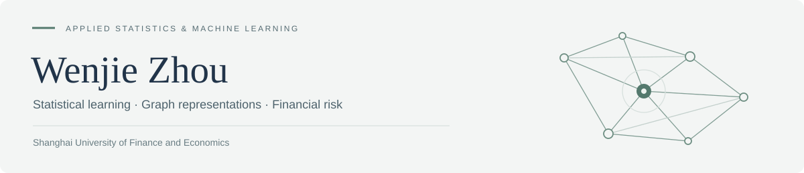

  

# 周文杰 · Wenjie Zhou

**上海财经大学 · 应用统计硕士 · 2027 届**

求职方向：**风控策略 / 风控算法 / 内容安全**

[代表项目](#代表项目) · [实习经历](#实习经历) · [技术能力](#技术能力) · [邮件联系](mailto:zhouwenjie_0617@163.com)

我关注如何把统计分析、机器学习与大模型应用转化为可评估的风控方案。在**度小满、百度、信飞科技**的实习中，参与过贷后风险分层、内容安全识别、语音情绪建模和分析工作流自动化；硕士课题聚焦严格时序评价下的财务造假检测。

## 我能带来的能力

| 风控策略与分析 | 风控算法与评估 | 大模型与内容安全 |
| :--- | :--- | :--- |
| 从业务目标出发，开展特征筛选、风险分层和指标归因 | 围绕风险识别任务，构建模型、设计对照并分析误差 | 结合业务判定边界，进行 Prompt 设计、分模态评测与工作流自动化 |
| 分箱 · IV / Lift · 规则策略 · 阈值分析 | 表格建模 · 图学习 · 文本 / 语音分类 · 时序验证 | 用户复审 · 引流内容识别 · Skill 封装 · 自动化报告 |

## 代表项目

### [MSAR-HGRN｜基于多源风险感知图网络的财务造假检测](https://github.com/RookieZhou0617/risk-aware-financial-fraud-detection)

**硕士课题 · 模型与最终测试已冻结 · 论文写作与修订中**

> 当企业自身风险模型已经较强时，异构关系还能提供什么额外预测信息？

- **企业风险锚点：** 融合财务特征、MD&A 文本、自身历史与交叉拟合风险，利用逐来源当前—历史偏差构建 MDRA。
- **关系增量学习：** 冻结锚点与分类器，通过邻居筛选、风险差异消息、可靠性门控和 NULL 通道学习隐藏表示残差。
- **严格评价：** 采用 2018–2021 年滚动开发评价与 2022 年固定协议 OOT，区分种子均值、集成指标和样本层不确定性。

| 2022 OOT · 五种子均值 | MDRA 风险锚点 | MSAR-HGRN |
| :--- | ---: | ---: |
| AUC-PR（average precision） | 0.4893 | **0.5071** |

图关系增量为 **+0.0178**。该结果是正向趋势而非显著性结论：配对 Bootstrap 95% 区间跨零，且 2019 年存在负迁移。完整结果与限制见项目文档。

**[项目首页 →](https://github.com/RookieZhou0617/risk-aware-financial-fraud-detection)** · [模型架构](https://github.com/RookieZhou0617/risk-aware-financial-fraud-detection/blob/main/assets/model-framework.png) · [实验结果](https://github.com/RookieZhou0617/risk-aware-financial-fraud-detection/blob/main/docs/experiments.md) · [合成示例](https://github.com/RookieZhou0617/risk-aware-financial-fraud-detection/tree/main/examples)

公开仓库提供方法说明、汇总结果与精简 PyTorch 示例，不分发真实业务数据或模型检查点，也不是完整论文的一键复现包。

## 实习经历

### 度小满 · 风控策略实习生

*2026.06—2026.08 · 贷后风险策略与分析自动化*

- **差异化分案策略：** 围绕贷后客群分层与分案目标，开展模型分验证、特征分箱及 IV / Lift 筛选，支持风险识别与策略优化。
- **指标分析自动化：** 将 SQL 取数、指标拆解、异常归因和报告生成串联为自动化工作流，支持核心贷后指标的日常分析。

### 百度 · 风控算法实习生

*2026.03—2026.06 · 风险用户复审与内容安全*

- **风险用户复审：** 从内容、用户及反作弊维度构建候选特征，结合大模型分类与 Precision / Recall 约束，辅助高风险用户召回和复审。
- **贴吧引流识别：** 针对贴吧留言咨询中的引流内容，拆分文本与多模态 Prompt，通过误判分析完善上下文、白名单和意图判定规则，提升识别效果。

### 信飞科技 · 风控算法实习生

*2025.12—2026.03 · 语音、文本与身份核验*

- **外呼情绪识别：** 参与音频分段、标注基准构建、多模型标签融合与 SenseVoice 适配，完成平静 / 愤怒情绪二分类建模与独立测试集评估。
- **质检与身份核验：** 微调 StructBERT 识别违规语义点；围绕相似人脸判别，探索 ArcFace 分类学习、难样本挖掘与损失函数调整。

实习内容仅展示职责与通用方法；不公开企业内部代码、平台细节、样本或业务策略参数。

## 技术能力

| 领域 | 技术与方法 |
| :--- | :--- |
| 数据处理与分析 | Python · SQL / Hive SQL · 特征工程 · 用户画像 · 指标归因 |
| 机器学习与建模 | Scikit-learn · PyTorch · LightGBM · 图神经网络 · 文本 / 语音分类 |
| 模型评估 | AUC-PR · Precision / Recall · F1 · 风险分层 · 阈值分析 · 时序验证 |
| 大模型应用 | Prompt 设计与评测 · 多模态误差分析 · Skill / Agent 工作流 |
| 开发工具 | Linux · Git · Codex · Claude Code |

## 教育背景

| 学校 | 学位 / 专业 | 时间 |
| :--- | :--- | :--- |
| **上海财经大学** | 应用统计 · 专业型硕士（推免） | 2025.09—2027.06（预计） |
| **济南大学** | 数据科学与大数据技术 · 理学学士 | 2021.09—2025.06 |

硕士 GPA **3.8 / 4.0，专业前 5%**，获一等奖学金；本科 GPA **4.82 / 5.0，专业第一**，连续四年获一等奖学金、校优秀毕业生。英语 **CET-6 580**。

English introduction

I am Wenjie Zhou, an M.S. student in Applied Statistics at Shanghai University of Finance and Economics, expecting to graduate in June 2027. I am seeking opportunities in **risk strategy, risk modeling and content safety**.

My internships at Duxiaoman, Baidu and Xinfei Technology cover post-loan risk segmentation, content-risk review, prompt evaluation, speech-emotion classification and automated analytics. My thesis studies how heterogeneous relations can add predictive information above a strong company-level risk anchor under temporal evaluation.

My [public research showcase](https://github.com/RookieZhou0617/risk-aware-financial-fraud-detection) contains the model design, aggregate evidence and a synthetic PyTorch demonstration, with explicit evaluation and reproduction boundaries.

---

欢迎交流风控策略、风控算法与内容安全相关机会。

**联系邮箱：[zhouwenjie_0617@163.com](mailto:zhouwenjie_0617@163.com)**
